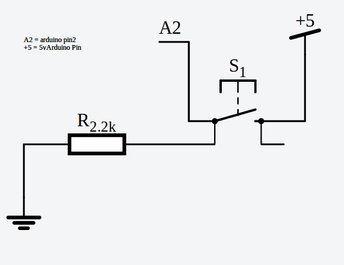

## Toggle switch using tactile button

Make those little tactile buttons work as a push button toggle switch. 

### How to use it

The library can be included into arduino sketch.

`#include "TactileSwitch.h";`

Declare

`TactileSwitch s;`

Initialized using the folllwing syntax

`s.init(2)` assuming, that the input pin being programmed is pin 2 (this could be any digital input pin)

Check for the state using 
```
	if(s.on())
	{
	// Do something
	}
	else
	{
	// Do something else
	}
```

ToggleSwicth.ino is an example sketch that uses the library. Press down on the button for more than 20 milliseconds will toggle the switch from on to off and vice versa.

Following is the schematic diagram 




